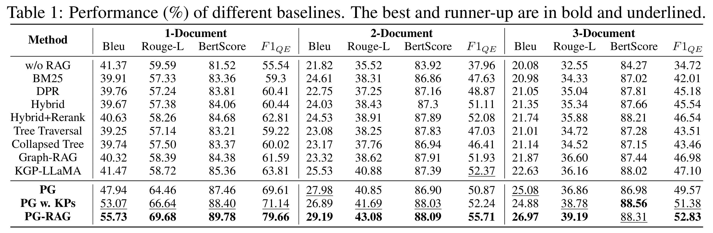

<h1 align="center">
    PG-RAG: Empowering Large Language Models to Set up a Knowledge Retrieval Indexer via Self-Learning
</h1>

<p align="center"></p>

## Introduction

PG-RAG proposes a pre-retrieval augmented generation method that introduces a _refinement_ step before the _indexing-retrieval-generation_ process, ensuring the accuracy of retrieved content from the outset. We leverage the self-learning capabilities of LLMs to transform documents into easily understandable and retrievable hierarchical indexes. This process naturally filters out noise and enhances information readability. By establishing connections between similar or complementary pieces of knowledge, we enable the retriever to function across multiple documents. During the knowledge retrieval phase, we use _pseudo-answers_ to assist the retriever in locating relevant information and perform walking in the matrices, thereby achieving accurate and rapid knowledge localization. Finally, we assemble the retrieved fact paths into a structured context, providing rich background information for LLMs to generate knowledge-grounded responses. 

<p align="center"></p>

<details><summary>Supported models of PG-RAG framework</summary>

| Model Type | Loading Method               | Example Models                     | References                                                                                                             |
|------------|------------------------------|------------------------------------|------------------------------------------------------------------------------------------------------------------------|
| `api`      | `requests`                   | OpenAI models | [OpenAI API](https://platform.openai.com/docs/introduction)|
| `local`    | HuggingFace `Sentence transformers`   | `BAAI/bge-large-zh-v1.5`             | [HuggingFace `Sentence transformers`](https://sbert.net/)                                                 |
| `remote`   | `requests`                   | Internal use only                  | Not available to the public                                                                                            |

</details>

<details><summary>A specific case of main topic and fact-checking items.</summary>

```json
{
  "Main Topic": "Announcement of the results of national medical device supervision sampling",
  "Fact-Checking Items": {
    "Date and Time": "2023-07-28",
    "Issuing Organization": "National Medical Products Administration",
    "Types of Products Sampled": "Dental low-voltage electric motors, various medical patches (far infrared therapy patches, magnetic therapy patches, acupoint magnetic therapy patches), among other five types",
    "Sampling Results": "A total of 12 batches (units) of products did not meet the standard requirements",
    "Specific Non-compliant Products and Issues": {
      "Dental Low-Voltage Electric Motor (1 unit)": "Produced by Guangdong Jingmei Medical Technology Co., Ltd., with issues related to leakage current and patient auxiliary current (under working temperature), and no-load speed not meeting the standard requirements.",
      "Vertical Pressure Steam Sterilizer (1 unit)": "Produced by Hefei Huatai Medical Equipment Co., Ltd., involving 'permissible limit values of accessible parts under normal conditions' and limit values under single fault condition (ground fault) not meeting the standard requirements.",
      "Electric Suction Device (1 unit)": "Produced by Suzhou Bein Technology Co., Ltd., involving 'network-powered, movable high negative pressure/high flow equipment' not meeting the standard requirements.",
      "Patch-type Medical Devices (far infrared therapy patch, magnetic therapy patch, acupoint magnetic therapy patch) 6 batches": "Produced by Jiujiang Gaoke Pharmaceutical Technology Co., Ltd., Zhengzhou Zhongyuan Fuli Industrial & Trade Co., Ltd., Ulanqab Qiao's Weiye Medical Device Co., Ltd., Hunan Dexi Medical Technology Co., Ltd., and Chongqing Zhengren Medical Device Co., Ltd., with issues involving detection of 'pharmaceutical ingredients that should not be detected according to supplementary testing methods.'",
      "Human Blood and Blood Component Plastic Bag Containers (blood bags) 3 batches": "Produced by Nanjing Sailjin Biomedical Co., Ltd., with issues involving non-compliance of the blood bag transfusion ports with the standards."
    }
  }
}
```

</details>

<details><summary>A specific case of the mind map generated through main topic and fact-checking items.</summary>

```json
{
  "Announcement of the results of national medical device supervision sampling": {
    "Announcement Date and Time": "July 28, 2023",
    "Sampled Items": [
      "Dental Low-Voltage Electric Motors",
      "Patch-Type Medical Devices (including Far Infrared Therapy Patches, Magnetic Therapy Patches, Acupoint Magnetic Therapy Patches)"
    ],
    "Total Number of Sampled Products": 12,
    "Number of Product Types Not Meeting Standard Requirements": 5,
    "Non-Compliant Medical Devices and Manufacturer Information": {
      "Dental Low-Voltage Electric Motor": {
        "Quantity": 1,
        "Manufacturer": "Guangdong Jingmei Medical Technology Co., Ltd.",
        "Issue Description": "Involving leakage current and patient auxiliary current, no-load speed not meeting the standard requirements"
      },
      "Vertical Pressure Steam Sterilizer": {
        "Quantity": 1,
        "Manufacturer": "Hefei Huatai Medical Equipment Co., Ltd.",
        "Issue Description": "Involving the allowable limit values of accessible parts under normal conditions and limit values under single fault condition (ground fault) not meeting the standard requirements"
      },
      "Electric Suction Device": {
        "Quantity": 1,
        "Manufacturer": "Suzhou Bein Technology Co., Ltd.",
        "Issue Description": "Involving network-powered, movable high negative pressure/high flow equipment not meeting the standard requirements"
      },
      "Patch-Type Medical Devices": {
        "Sub-Types": [
          "Far Infrared Therapy Patch",
          "Magnetic Therapy Patch",
          "Acupoint Magnetic Therapy Patch"
        ],
        "Batch Quantity": 6,
        "List of Manufacturers": [
          "Jiujiang Gaoke Pharmaceutical Technology Co., Ltd.",
          "Zhengzhou Zhongyuan Fuli Industrial & Trade Co., Ltd.",
          "Ulangab Qiao's Weiye Medical Device Co., Ltd.",
          "Hunan Dexi Medical Technology Co., Ltd.",
          "Chongqing Zhengren Medical Device Co., Ltd."
        ],
        "Issue Description": "Involving detection of pharmaceutical ingredients that should not be detected according to supplementary testing methods"
      },
      "Human Blood and Blood Component Plastic Bag Containers (Blood Bags)": {
        "Quantity": 3,
        "Manufacturer": "Nanjing Sailjin Biomedical Co., Ltd.",
        "Issue Description": "Involving blood bag transfusion ports not meeting the standard requirements"
      }
    }
  }
}

```

</details>

<details><summary>A specific case of fact path in PG.</summary>

"Announcement of the results of national medical device supervision sampling"> "Non-Compliant Medical Devices and Manufacturer Information"> "Dental Low-Voltage Electric Motor"> "Manufacturer"> "Guangdong Jingmei Medical Technology Co., Ltd."

</details>

<details><summary>Project structure</summary>

```bash
.
├── .github
├── .gitignore
├── CITATION.bib
├── LICENSE
├── README.md
├── assets                  # Static files like images used in documentation
├── data                    # Datasets (e.g.,  1-Document QA)
├── output                  # Stores the contexts of querys
├── requirements.txt
└── pgrag                   # Source code for the project
    ├── configs             # Scripts for initializing model loading parameters
    ├── data             # Intermediate result data  
        ├── raw_news             # The original documents required for the retrieval library building
        ├── pg_gen             # Data during the pseudo-graph construction process  
        └── context_recall            # Data during the pseudo-graph retrieval process
    ├── mindmap_generator.py          # Scripts for generating mind maps
    ├── pseudo_graph_constructor.py             # Scripts for pseudo-graph construction
    ├── seed_context_recall.py           # Scripts for seed contexts recall
    ├── sub_pseudo_graph_retriever.py           # Scripts for structured contexts recall
    ├── llm                 # Calling LLM methods
    └── prompts             # Prompt Engineering
```

</details>

## Installation

Before using PG-RAG:

1. Ensure you have Python 3.9.0+
2. Install the required packages:

   ```bash
   pip install -r requirements.txt
   ```

3. Prerequisites

- **JDK 17**: Ensure you have JDK 17 installed on your machine.
- **Neo4j**: Download and install Neo4j. Start the Neo4j console using the following command:
  
  ```bash
  neo4j console
  ```

## PG-RAG Pipeline

This repository contains the implementation of the PG-RAG (Pseudo-Graph Retrieval Augmented Generation) pipeline. The pipeline consists of four main stages: mind map generation, pseudo-graph construction, seed context recall, and final context extension and generation.

### Common Setup

Before running the individual scripts, ensure the following configuration:

```python
graph_uri = "bolt://localhost:7687"
graph_auth = ("neo4j", "password")
emb_model_name = "/path/to/your/local/bge-base-zh-1.5"
num_threads = 20
topK = 8

# Parameters for Pseudo-Graph Construction
model_name = 'gpt-3.5-turbo' # Model name can be: gpt-3.5-turbo, gpt-4-0613, gpt-4-1106-preview
raw_news_files_dir = 'data/raw_news/batch0'
title_files_dir = 'data/pg_gen/batch0/title'
fcis_files_dir = "data/pg_gen/batch0/textToVerificationText/"
mindmaps_str_files_dir = "data/pg_gen/batch0/mindmap_str/"
mindmaps_json_files_dir = "data/pg_gen/batch0/mindmap_json/"

# Parameters for Knowledge Recall via Pseudo-Graph Retrieval
eval_data_with_qe_and_qdse_file = 'data/eval/eval_data_with_qe_and_qdse.json'
seed_topic_file = 'data/context_recall/pgrag/seed_topics.json'
candidate_topic_file = 'data/context_recall/pgrag/candidate_topics.json'
matrix_templates_file = 'data/context_recall/pgrag/matrix_templates.json'
matrix_templates_with_sim_file = 'data/context_recall/pgrag/matrix_templates_with_sim.json'
contexts_ids_file = 'data/context_recall/pgrag/contexts_ids.json'
final_contexts_file = 'data/context_recall/pgrag/final_contexts.json'

recall_top_m = 3 
walk_top_m = 6  
```

Ensure Neo4j database is running and accessible at the specified `graph_uri`. Adjust file paths and model names as per your environment setup. Modify the parameters as needed to fine-tune the performance and results.

## Steps to Execute

1. **Generate Mind Maps**: Generate mind maps for original texts using `pgrag/mindmap_generator.py`.
2. **Build Pseudo-Graph**: Construct a pseudo-graph through `pgrag/pseudo_graph_constructor.py`.
3. **Seed Context Recall**: Recall seed topics using `pgrag/seed_context_recall.py`.
4. **Final Context Extensions**: Perform final context extensions and context generation using `pgrag/sub_pseudo_graph_retriever.py`.

### 1. Generate Mind Maps

To generate mind maps from the original texts:

```python
# pgrag/mindmap_generator.py

mindmap_generation = MindmapGeneration(model_name, num_threads, raw_news_files_dir, title_files_dir, fcis_files_dir, mindmaps_str_files_dir, mindmaps_json_files_dir)
mindmap_generation.execute()
```

### 2. Build Pseudo-Graph

To build the pseudo-graph:

```python
# pgrag/pseudo_graph_constructor.py

inserter = Neo4jDataInserter(graph_uri, graph_auth, emb_model_name, num_threads)
inserter.execute(raw_news_files_dir, mindmaps_json_files_dir)

fusion = TopicAndContentFusion(graph_uri, graph_auth, emb_model_name)
fusion.fuse_topics_and_contents()
```

### 3. Seed Context Recall

To recall seed contexts:

```python
# pgrag/seed_context_recall.py   

seed_context_recall = SeedContextRecall(graph_uri, graph_auth, emb_model_name, eval_data_with_qe_and_qdse_file, seed_topic_file, candidate_topic_file, recall_top_m, walk_top_m, num_threads, topK)
seed_context_recall.execute()
```

### 4. Final Context Extensions

To perform final context extensions and context generation:

```python
# pgrag/sub_pseudo_graph_retriever.py

processor = PG_RAG_Processor(graph_uri, graph_auth, candidate_topic_file, matrix_templates_file, matrix_templates_with_sim_file, topK)
processor.create_matrix_templates()
processor.compute_similarity_matrices()
processor.process_top_k_ids(contexts_ids_file, final_contexts_file)
```

## Results for Experiment

<p align="center"></p>

